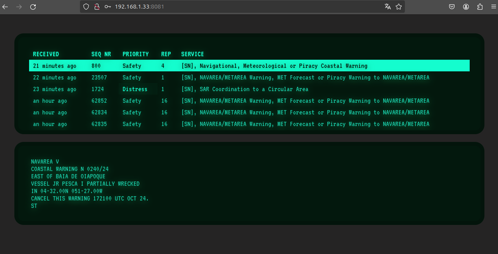

## inmarsat-web-console
This is a web appication written in nodejs that uses the files produced by Satdump to display the Inmarsat messages in a web interface.



## Prerequisites
Before you run the project, ensure you have the following installed:
- [Node.js](https://nodejs.org/) (v14 or higher)
- [npm](https://www.npmjs.com/)

## Project Setup
To set up the project, follow these steps:

1. **Clone the Repository**
   Clone this repository to your local machine:
   ```bash
   git clone https://github.com/your-repo/satdump-web-interface.git

2. **Install the dependencies**
   Navigate to the project directory and install the necessary dependencies:
   ```bash
   cd satdump-web-interface
   npm install
   
3. **Setup the environmental variables**
   Create a .env file in the root of the project, and add the following variables to configure the application:

   ```bash
    PORT=8443
    USERNAME=admin
    PASSWORD=admin
    SECURE=false
    PUBLIC=false
    SAFETYNET=true
    SATDUMP_FILE_PATH=  # Path to the SatDump data file, this should be the value $dir descried in the "Run satdump" step
   ```

   Adjust these values according to your environment and application needs.

4. **Start the application**
   Once you've set up the environment variables, start the application with:
   ```bash
   npm run start

Now you can access the web interfave with a web browser at http://localhost:8443

If you've changed the PORT in the .env file, use the corresponding port number.

There is also the possibility to send the received safetyNet distress messages to a telegram channel by configuring the followings variales in the .env file:
```bash
TELEGRAM_ENABLE=true
TELEGRAM_CHANNEL=   # Telegram channel
TELEGRAM_TOKEN=   # Telegram token
```

## Run satdump
Start satdump as follows to feed the console.
```bash
satdump live inmarsat_std_c $dir --source rtlsdr 1 --samplerate 2.4e6 --frequency 1537.100e6 --gain 38 --bias --dc_block
```
where $dir is the the directory where to save the files.

## TODO
Create a build for the client